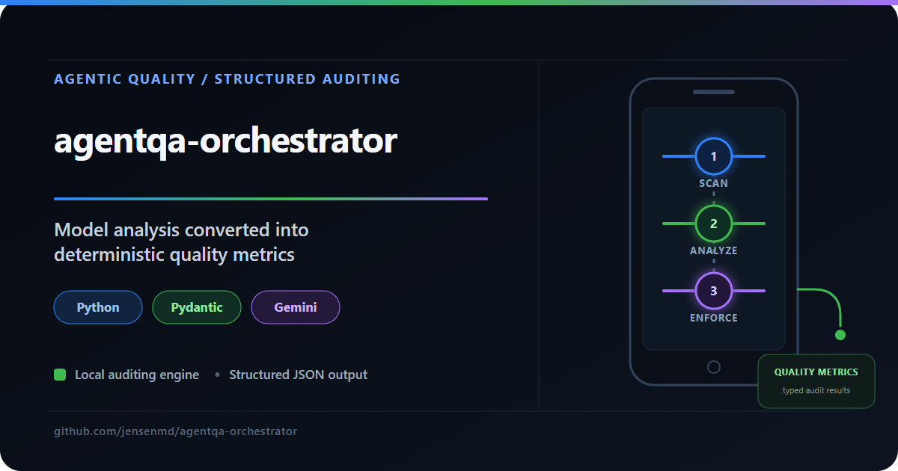

# agentqa-orchestrator



An agentic code-auditing tool that scans local QA repositories, sends selected source files through an LLM-backed analysis workflow, enforces structured output with Pydantic, and writes machine-readable JSON audit artifacts.

The project explores a practical quality-engineering question: **how can generative AI be used inside an automated QA workflow without treating free-form conversational output as a reliable system interface?**

🔗 [LinkedIn](https://www.linkedin.com/in/michaeljensen-qa/) | 🐙 [GitHub](https://github.com/jensenmd) | 📧 jensen.md@gmail.com

---

## What This Project Demonstrates

| Component | Stack | Purpose |
| --- | --- | --- |
| **Local Directory Scanner** | Python | Inventories and filters target repository files for analysis |
| **LLM Audit Workflow** | Google GenAI / Gemini 2.5 Flash | Analyzes selected source files for quality signals |
| **Schema Enforcement** | Pydantic v2 | Converts open-ended LLM output into structured, typed audit data |
| **Artifact Generation** | JSON | Writes one machine-readable audit artifact per analyzed file |
| **Runtime Dashboard** | Python console output | Summarizes health scores and audit status across the target repository |
| **Resilience Handling** | Python exceptions / pacing | Handles API failures and rate-limit boundaries during analysis |

The combination of structured schemas and local orchestration demonstrates one way to turn open-ended LLM analysis into repeatable, machine-readable QA output.

---

## Design Approach

The project separates the workflow into four responsibilities:

- repository discovery and file selection
- LLM-backed code analysis
- schema validation and structured artifact generation
- human-readable summary reporting

The goal is to keep generative analysis inside a predictable programmatic workflow rather than treating conversational output as the final QA artifact.

---

## Project Structure

```text
agentqa-orchestrator/
├── file_scanner.py         # Maps and filters target repository files
├── code_auditor.py         # Core audit workflow and schema enforcement
├── showcase_dashboard.py   # Runs the audit and prints summary metrics
├── test_connection.py      # Verifies API connectivity
├── test_schema.py          # Validates structured audit schema behavior
├── reports/                # Generated JSON audit artifacts
│   ├── audit_validate_brewery_data.json
│   ├── audit_conftest.json
│   └── audit_test_api.json
└── README.md
```

---

## Sample Telemetry Output

When executed against a target QA repository, the orchestrator processes selected files sequentially and writes structured audit artifacts:

```text
====================================================================
                    AGENTIC QA AUDIT ENGINE
====================================================================
Scanning target directory: C:\Users\mdj3n\Documents\dev\qa-automation-showcase

[SCAN] Found 3 source files. Initializing analysis pipeline...

[1/3] Analyzing: validate_brewery_data.py
  -> Querying execution engine [gemini-2.5-flash]...
  -> Exported structured JSON to reports\audit_validate_brewery_data.json

[2/3] Analyzing: conftest.py
  -> Querying execution engine [gemini-2.5-flash]...
  -> Exported structured JSON to reports\audit_conftest.json

[3/3] Analyzing: test_api.py
  -> Querying execution engine [gemini-2.5-flash]...
  -> Exported structured JSON to reports\audit_test_api.json

====================================================================
                        FINAL ENGINE METRICS
====================================================================
 FILE NAME                      | HEALTH SCORE | STATUS
--------------------------------------------------------------------
 validate_brewery_data.py       | [75 / 100]   | PASS
 conftest.py                    | [80 / 100]   | PASS
 test_api.py                    | [88 / 100]   | PASS
--------------------------------------------------------------------
[COMPLETE] Artifact generation cycle finished. Target directory analyzed.
====================================================================
```

Each audited file generates an isolated JSON artifact containing structured fields such as:

- `health_score`
- `test_coverage_gaps`
- `code_smells`
- `recommended_refactor`

This makes the LLM output easier to inspect, compare, store, and consume programmatically.

---

## Running Locally

### Prerequisites

- Python 3.10+
- Gemini API key

### 1. Initialize the Environment

Activate the virtual environment:

```powershell
.venv\Scripts\Activate.ps1
```

Install the core dependencies:

```powershell
pip install google-genai pydantic
```

### 2. Set API Credentials

Set the Gemini API key in the current PowerShell session:

```powershell
$env:GEMINI_API_KEY="your_actual_api_key_here"
```

### 3. Run the Audit

Execute the dashboard entry point:

```powershell
python showcase_dashboard.py
```

---

## Relationship to Other Portfolio Projects

This project is part of a broader QA portfolio demonstrating complementary quality engineering skills:

| Project | Focus | Stack |
| --- | --- | --- |
| **agentqa-orchestrator** (this repo) | Agentic code auditing with structured LLM output | Python / Gemini / Pydantic / JSON |
| [mapmyrun-quality-investigation](https://github.com/jensenmd/mapmyrun-quality-investigation) | Black-box mobile/GPS QA investigation — field testing and evidence-bounded analysis | iPhone / Apple Watch / MapMyRun / field evidence |
| [claude-code-qa-sessions](https://github.com/jensenmd/claude-code-qa-sessions) | Agentic QA analysis with human-reviewed recommendations | Claude Code / GitHub / QA analysis |
| [ai-qa-framework](https://github.com/jensenmd/ai-qa-framework) | AI-assisted test generation, human-in-the-loop validation | Python / Claude API / pytest / GitHub Actions |
| [qa-automation-showcase](https://github.com/jensenmd/qa-automation-showcase) | REST API testing, data validation, CI/CD integration | Python / pytest / Postman / GitHub Actions |
| [restful-booker-qa](https://github.com/jensenmd/restful-booker-qa) | Full-stack layered testing — API + UI automation | Postman / Newman / Playwright / GitHub Actions |
| [pharmacy-spend-etl-qa](https://github.com/jensenmd/pharmacy-spend-etl-qa) | ETL pipeline validation, SQL-driven data integrity testing | Python / pytest / SQLite / pandas |

Together they demonstrate API testing, data validation, UI automation, ETL quality, AI-assisted QA workflows, agentic code analysis, exploratory investigation, and evidence-driven quality engineering across multiple system layers.

---


---

## QA Portfolio Quick Reference

This project is part of a broader QA portfolio demonstrating complementary quality-engineering skills.

| Project | Focus |
|---|---|
| [android-appium-wdio-poc](https://github.com/jensenmd/android-appium-wdio-poc) | Native Android UI automation proof of concept using Appium, WebdriverIO, TypeScript, and UiAutomator2 |
| [mapmyrun-quality-investigation](https://github.com/jensenmd/mapmyrun-quality-investigation) | Black-box mobile and GPS quality investigation using field evidence and bounded conclusions |
| [restful-booker-qa](https://github.com/jensenmd/restful-booker-qa) | Layered API and UI automation using Postman, Newman, Playwright, and GitHub Actions |
| [pharmacy-spend-etl-qa](https://github.com/jensenmd/pharmacy-spend-etl-qa) | ETL pipeline and SQL-driven data-integrity validation modeled after healthcare analytics work |
| [qa-automation-showcase](https://github.com/jensenmd/qa-automation-showcase) | REST API testing, data validation, and CI/CD-integrated automation |
| [ai-qa-framework](https://github.com/jensenmd/ai-qa-framework) | Human-reviewed AI-assisted test generation with structured cases and pytest execution |
| [claude-code-qa-sessions](https://github.com/jensenmd/claude-code-qa-sessions) | Agentic analysis of existing QA repositories with human review and targeted implementation |
| [agentqa-orchestrator](https://github.com/jensenmd/agentqa-orchestrator) **(this repository)** | Structured agentic code auditing using Python, Pydantic, Gemini, and JSON |

## Author

**Michael D. Jensen**  
Senior QA Engineer

15+ years of enterprise software quality experience across healthcare IT, financial systems, telecommunications, and cybersecurity, with current hands-on work in Python automation, API testing, data validation, AI-assisted QA workflows, and quality engineering investigations.

🔗 [LinkedIn](https://www.linkedin.com/in/michaeljensen-qa/) | 🐙 [GitHub](https://github.com/jensenmd) | 📧 jensen.md@gmail.com
